# 🚀 Personal Developer Portfolio

A modern, fully responsive **developer portfolio website** built to showcase my projects, skills, and experience.  
It also includes interactive features like a **Word Scramble Game** and a fully functional **Contact System powered**.

---

## 🌐 Live Project

🔗 **[Aaiswarya PM](https://fullstack-portfolio-mu-puce.vercel.app/)**

---

## 📌 Features

- 🎨 Modern UI with responsive design
- 🌙 Dark / Light theme support
- ⚡ Smooth animations using Framer Motion
- 📂 Projects showcase section with live demos & GitHub links
- 🧠 Interactive **Word Scramble Game** (fun mini-game inside portfolio)
- 📬 Contact form with real-time email delivery
- 🔒 Secure backend API integration
- 📱 Fully mobile responsive

---

## 🧩 Word Scramble Game

This portfolio includes a **Word Scramble Game** as a personal interactive section to enhance user engagement.

### Features:
- Randomized word generation
- Score tracking system
- Timer-based challenge mode
- Simple and clean UI
- Built using vanilla JavaScript logic

---

## 🛠️ Tech Stack

### Frontend
- React.js (Vite)
- Tailwind CSS
- Framer Motion
- Axios

### Backend
- Node.js
- Express.js
- MongoDB (Atlas)
- Resend Email API

### Deployment
- Frontend: Vercel
- Backend: Render

---

## 📬 Contact System

The contact form is fully functional and integrated with **Resend Email Service**.

### Workflow:
1. User submits message via contact form
2. Data is stored in MongoDB
3. Email is sent to the owner via Resend API

---

## 🔒 Security & Backend Enhancements

To improve application security, reliability, and data integrity, the backend implements multiple protection layers.

### ✅ Server-Side Validation

The backend validates all incoming contact form data before processing:

- Name is required
- Email is required
- Message is required
- Name length validation
- Email format validation using Regular Expressions
- Message length validation

Example:

- Name: 2–50 characters
- Message: 10–1000 characters

**This ensures the backend never trusts client-side validation alone.**

---

### ✅ Input Sanitization

User inputs are sanitized before storage and email processing.

Protected against:

- Basic Cross-Site Scripting (XSS) attempts
- HTML tag injection
- Invalid special character injection

Example:

Before: ```<script>alert("hack")</script>```

After Sanitization: ```scriptalert("hack")/script```

---

### ✅ Rate Limiting

To prevent spam and abuse, the backend uses request rate limiting.

Current Configuration:

- Maximum 5 requests
- Per 15-minute window
- Applied specifically to contact form submissions

If the limit is exceeded:

```json
{
  "success": false,
  "message": "Too many requests. Please try again later."
}
```

Benefits:

- Prevents spam bots
- Reduces email abuse
- Protects backend resources
- Improves API reliability

---

## 📖 API Documentation

The backend API is documented using Swagger (OpenAPI Specification).

### Swagger UI

🔗 https://portfolio-backend-acqk.onrender.com/api-docs

### Available Endpoint
```http
POST /api/contacts
```

```http
GET /api/projects
```

#### Request Body

```json
{
  "name": "John Doe",
  "email": "john@example.com",
  "message": "Hello, I would like to connect with you."
}
```

#### Success Response (200)

```json
{
  "success": true,
  "message": "Message sent successfully"
}
```

#### Validation Error Response (400)

```json
{
  "success": false,
  "message": "Invalid email"
}
```

#### Server Error Response (500)

```json
{
  "success": false,
  "message": "Server Error"
}
```

Swagger UI provides:

- Interactive API testing
- Request/Response examples
- Schema definitions
- Endpoint documentation

---

## ⚙️ Environment Variables

Backend requires the following environment variables:

```
MONGODB_URI=your_mongodb_connection_string
RESEND_API_KEY=your_resend_api_key
MY_EMAIL=your_email_address
PORT=5000
```
---

## 🏗️ System Architecture

```mermaid
flowchart LR

    A["🎨 React Frontend<br/>Portfolio UI"] --> B["📡 Axios API Requests"]

    B --> C["🚀 Express.js Backend"]

    subgraph Security Layer
        D["✅ Server-Side Validation"]
        E["🛡️ Input Sanitization"]
        F["⏱️ Rate Limiting"]
    end

    C --> D
    D --> E
    E --> F

    F --> G["🍃 MongoDB Atlas<br/>Data Storage"]

    G --> H["📧 Resend Email API"]

    H --> I["👤 Portfolio Owner"]

    style A fill:#61DAFB,color:#000,stroke:#0A0A0A,stroke-width:2px
    style B fill:#A855F7,color:#fff,stroke:#0A0A0A,stroke-width:2px
    style C fill:#111827,color:#fff,stroke:#61DAFB,stroke-width:2px
    style D fill:#22C55E,color:#fff,stroke:#0A0A0A,stroke-width:2px
    style E fill:#F59E0B,color:#fff,stroke:#0A0A0A,stroke-width:2px
    style F fill:#EF4444,color:#fff,stroke:#0A0A0A,stroke-width:2px
    style G fill:#47A248,color:#fff,stroke:#0A0A0A,stroke-width:2px
    style H fill:#000000,color:#fff,stroke:#FFFFFF,stroke-width:2px
    style I fill:#8B5CF6,color:#fff,stroke:#0A0A0A,stroke-width:2px
```



---

## 🎯 Key Concepts Demonstrated

- REST API Development
- Client-Server Architecture
- CRUD Operations
- MongoDB Integration
- Mongoose ODM
- Server-Side Validation
- Input Sanitization
- Rate Limiting
- Email Automation
- API Documentation with Swagger
- Error Handling
- Responsive UI Design
- State Management using React Hooks
- Deployment using Vercel & Render

---

## 👩‍💻 Author

**Aaiswarya PM**

Aspiring MERN-Stack Developer passionate about building scalable, secure, and user-friendly web applications.
